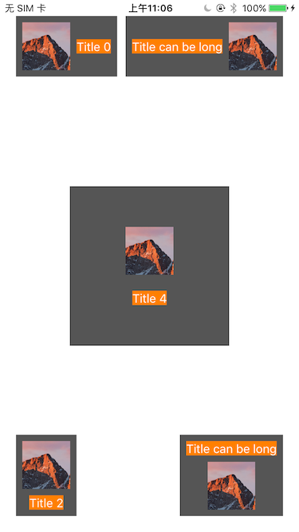

# ZBLayoutButton

A simple class inherited from UIButton. You can set the layout direction in four as you want . And the screenshots has been attached below:



Drag the ZBLayoutButton.swift in to your target, initialize it like using UIButton.

Note:  There are two property should be attention :

```swift
var textAttributes: [NSAttributedStringKey : Any]
var padding: CGFloat
var layoutDirection: ZBLayoutDirection
```

* `textAttributes` is used for calculating label size cause the calling `button.titleLabel` in `titleRect(forContentRect contentRect: CGRect) -> CGRect` could lead to endless loop. You should pass value for it before you add button to window or it'll use the default value `[NSAttributedStringKey.font: UIFont.systemFont(ofSize: 18.0)`
* `padding` is the padding between image and the label. It only take effects while image and label text both not empty
* `layoutDirection` controls the layout direction for the image view and the label.

More details can be clear in sample code. The source code is simple. Yes, this is just a practice for learning Swift, Use it in your project if you do not mind 🤣.